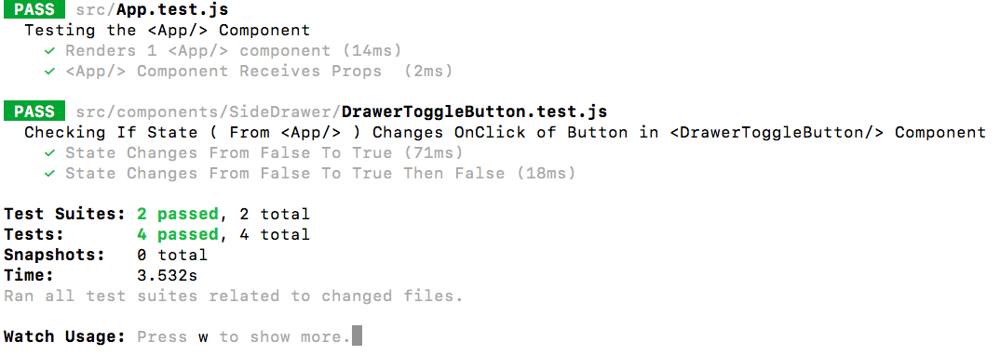

# Unit Testing In ReactJs 

This is an app designed to setup and create Unit Test Cases In ReactJs Using Jest and Enzyme.

**Functionalities Of Unit Tests:** 

1. Checking The Value Of The Initial State.
2. Checking If State In Parent Component Changes, onClick Of A Button In The Child Component.

I am using **React, Jest & Enzyme** and **create-react-app CLI**.

To run this app:
* `cd unit_testing_react`
* `git clone https://github.com/RohitoOo/Jest_Testing.git` - Clone this repo
* `cd into_directory` - Access Root Directory
* `npm install` - Install Back End Dependencies
* `npm run test` - Run Unit Test    
* `npm start` - View Application

*Make Sure You Have nodeJs Installed Locally*

Personal Portfolio
-------------------

[Rohit Bhambhani](http://rohito.com)